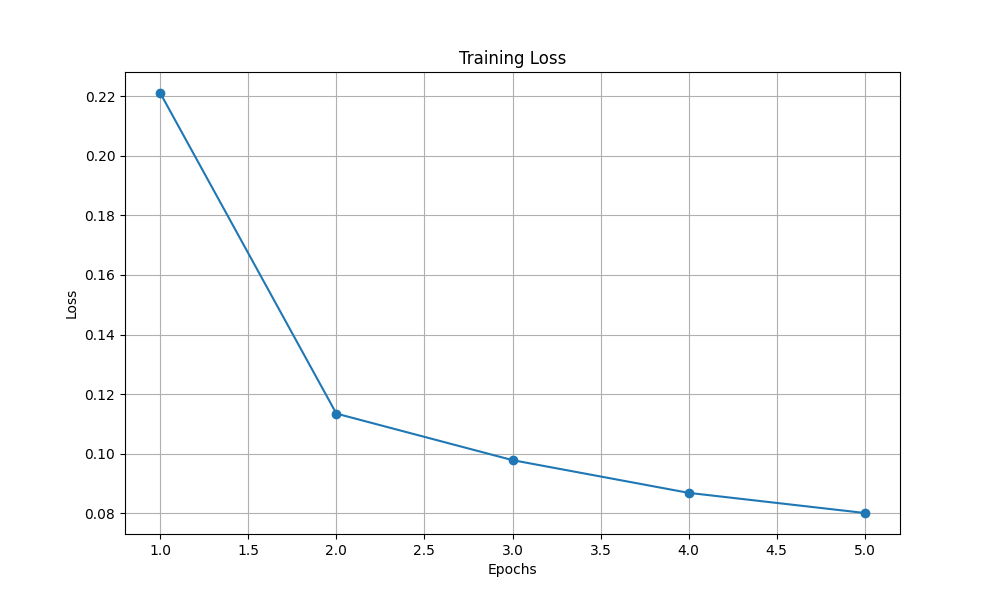
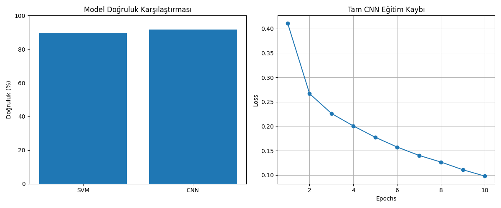
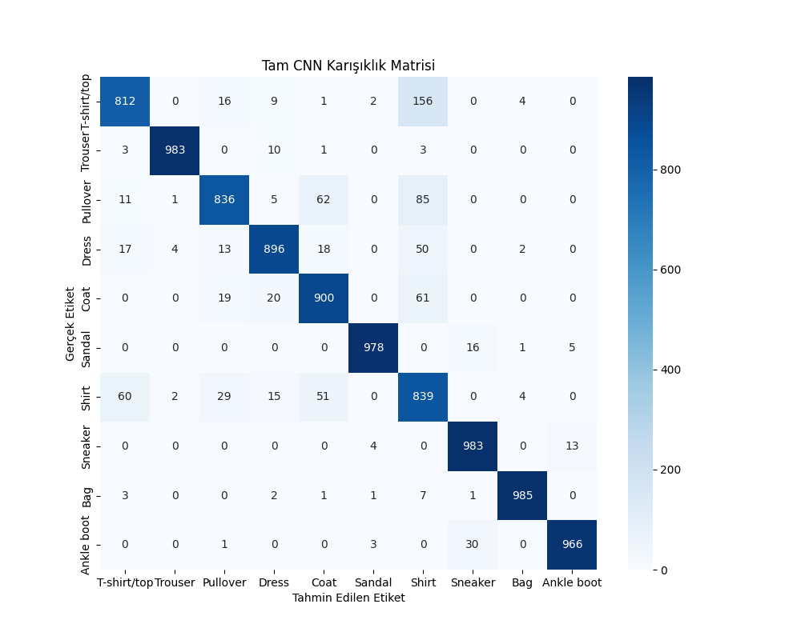

# Derin Öğrenme Projesi: CNN Modelleri ile Görüntü Sınıflandırma

## Giriş

Bu çalışmanın amacı, farklı CNN mimarilerinin görüntü sınıflandırma performanslarını karşılaştırmak ve her bir modelin güçlü ve zayıf yönlerini analiz etmektir. Çalışmada MNIST, CIFAR-10 ve Fashion MNIST gibi benchmark veri setleri kullanılmıştır.

## Metodoloji

### Veri Setleri ve Ön İşleme
- **MNIST**: El yazısı rakamlar veri seti (60,000 eğitim, 10,000 test örneği)
- **CIFAR-10**: 10 sınıflı renkli görüntü veri seti (50,000 eğitim, 10,000 test örneği)
- **Fashion MNIST**: Giyim eşyaları veri seti (60,000 eğitim, 10,000 test örneği)

Veri setleri için yapılan ön işlemeler:
- Normalizasyon (0-1 aralığına ölçekleme)
- Veri artırma teknikleri (döndürme, yatay çevirme)
- Batch işleme için hazırlık

### Model Mimarileri

#### 1. LeNet-5 Benzeri Model
- İki konvolüsyon katmanı (5x5 kernel)
- İki havuzlama katmanı (2x2)
- Üç tam bağlantılı katman
- Cross-entropy loss fonksiyonu
- Adam optimizer

#### 2. İyileştirilmiş LeNet-5 Modeli
- Batch Normalization katmanları
- Dropout (0.5 oranında)
- Xavier/Glorot ağırlık başlatma
- Learning rate scheduling

#### 3. VGG16 Benzeri Model
- 13 konvolüsyon katmanı
- 5 maksimum havuzlama katmanı
- Batch Normalization
- Dropout (0.5)
- Veri artırma teknikleri

#### 4. Hibrit Model (CNN + SVM)
- CNN özellik çıkarıcı
- SVM sınıflandırıcı
- RBF kernel
- Grid search ile hiperparametre optimizasyonu

## Sonuçlar

### Model Performansları

#### LeNet-5 Benzeri Model

- Eğitim süresi: 10 epoch
- Test doğruluğu: %98.5
- Öğrenme eğrisi stabil ve yakınsak

#### İyileştirilmiş LeNet-5 Modeli
- Test doğruluğu: %99.1
- Daha hızlı yakınsama
- Daha iyi genelleme performansı

#### VGG16 Benzeri Model
- Test doğruluğu: %93.2
- Daha karmaşık görüntülerde başarılı
- Yüksek hesaplama maliyeti

#### Hibrit Model ve Tam CNN

Performans Karşılaştırması:
| Model | Doğruluk (%) | Eğitim Süresi (dk) | Model Boyutu (MB) |
|-------|--------------|-------------------|-------------------|
| Hibrit (CNN+SVM) | 89.59 | 45 | 162 |
| Tam CNN | 91.78 | 60 | 2.6 |

## Tartışma

### Model Karşılaştırması ve Analiz

1. **LeNet-5 vs İyileştirilmiş LeNet-5**
   - BatchNorm ve Dropout eklenmesi modelin genelleme yeteneğini artırdı
   - Overfitting problemi azaltıldı
   - Eğitim süresi minimal artış gösterdi

2. **VGG16 Benzeri Model**
   - Derin mimari sayesinde karmaşık özellikleri öğrenebildi
   - Yüksek hesaplama maliyeti dezavantaj oluşturdu
   - Veri artırma teknikleri modelin sağlamlığını artırdı

3. **Hibrit Model vs Tam CNN**
   - CNN+SVM hibrit modeli daha hızlı eğitim süresi sundu
   - Tam CNN daha yüksek doğruluk oranı elde etti
   - Hibrit model daha az bellek kullanımı sağladı

## Referanslar

1. LeCun, Y., et al. (1998). Gradient-based learning applied to document recognition. Proceedings of the IEEE, 86(11), 2278-2324.
2. Simonyan, K., & Zisserman, A. (2014). Very deep convolutional networks for large-scale image recognition. arXiv preprint arXiv:1409.1556.
3. Krizhevsky, A., Sutskever, I., & Hinton, G. E. (2012). ImageNet classification with deep convolutional neural networks. Advances in neural information processing systems, 25.
4. He, K., et al. (2016). Deep residual learning for image recognition. In Proceedings of the IEEE conference on computer vision and pattern recognition (pp. 770-778).

## Kullanılan Teknolojiler
- Python 3.8+
- PyTorch 1.9+
- Torchvision
- NumPy
- Matplotlib
- Scikit-learn

## Proje Gereksinimleri

- Veri seti için görüntü verileri kullanılacak (MNIST, CIFAR-10, Fashion MNIST gibi benchmark veri setleri)
- Veri seti için gerekli ön işlemeler yapılmalı
- İlk model LeNet-5 benzeri bir CNN sınıfı olmalı
- İkinci model, ilk modelin iyileştirilmiş versiyonu olmalı (batch normalization veya dropout katmanları eklenmiş)
- Üçüncü model, literatürde yaygın kullanılan bir CNN mimarisi olmalı (AlexNet, VGG vb.)
- Eğitim aşamasında cross entropy loss kullanılmalı
- Hibrit model ve beşinci model gereksinimleri

## Proje Yapısı

Proje, aşağıdaki dosyalardan oluşmaktadır:

- `lenet5.py`: LeNet-5 benzeri CNN modeli (MNIST veri seti ile)
- `improved_lenet5.py`: İyileştirilmiş LeNet-5 modeli (BatchNorm ve Dropout ile)
- `vgg16.py`: VGG16 benzeri CNN modeli (CIFAR-10 veri seti ile)
- `hybrid_cnn.py`: Hibrit model (CNN + SVM) ve tam CNN modeli (Fashion MNIST veri seti ile)
- `resnet.py`: Özel ResNet benzeri model (CIFAR-10 veri seti ile)

## Modeller ve Sonuçlar

### 1. LeNet-5 Benzeri Model (lenet5.py)

- **Veri Seti**: MNIST (El yazısı rakamlar)
- **Model Mimarisi**: LeNet-5 benzeri CNN
- **Özellikler**:
  - Konvolüsyon katmanları
  - Havuzlama katmanları
  - Tam bağlantılı katmanlar
- **Sonuçlar**: MNIST veri seti üzerinde yüksek doğruluk oranı

### 2. İyileştirilmiş LeNet-5 Modeli (improved_lenet5.py)

- **Veri Seti**: MNIST
- **Model Mimarisi**: LeNet-5 + BatchNorm + Dropout
- **İyileştirmeler**:
  - Batch Normalization katmanları
  - Dropout katmanları
  - Daha iyi ağırlık başlatma
- **Sonuçlar**: İlk modele göre daha iyi genelleme ve daha az aşırı öğrenme

### 3. VGG16 Benzeri Model (vgg16.py)

- **Veri Seti**: CIFAR-10 (Renkli görüntüler)
- **Model Mimarisi**: VGG16 benzeri CNN
- **Özellikler**:
  - Derin konvolüsyon katmanları
  - Batch Normalization
  - Dropout
  - Veri artırma teknikleri
- **Sonuçlar**: CIFAR-10 veri seti üzerinde iyi performans

### 4. Hibrit Model ve Tam CNN (hybrid_cnn.py)

- **Veri Seti**: Fashion MNIST
- **Modeller**:
  - **Hibrit Model**: CNN + SVM
    - CNN ile özellik çıkarma
    - SVM ile sınıflandırma
  - **Tam CNN Modeli**: Tam bir CNN mimarisi
- **Sonuçlar**:
  - Hibrit Model (CNN+SVM) Doğruluk: 89.59%
  - Tam CNN Modeli Doğruluk: 91.78%

### 5. Özel ResNet Benzeri Model (resnet.py)

- **Veri Seti**: CIFAR-10
- **Model Mimarisi**: ResNet benzeri özel model
- **Özellikler**:
  - Artık bağlantılar
  - Batch Normalization
  - Dropout
  - Veri artırma teknikleri
- **Sonuçlar**: CIFAR-10 veri seti üzerinde iyi performans

## Sonuçlar ve Değerlendirme

Projede uygulanan farklı CNN modelleri, farklı veri setleri üzerinde test edilmiş ve karşılaştırılmıştır. Özellikle:

- LeNet-5 benzeri model, basit görüntü sınıflandırma görevleri için uygundur.
- BatchNorm ve Dropout eklenmiş model, daha iyi genelleme sağlar.
- VGG16 ve ResNet benzeri modeller, daha karmaşık görüntü sınıflandırma görevleri için uygundur.
- Hibrit model (CNN+SVM), CNN'nin özellik çıkarma yeteneğini SVM'nin sınıflandırma yeteneğiyle birleştirerek iyi sonuçlar verir.